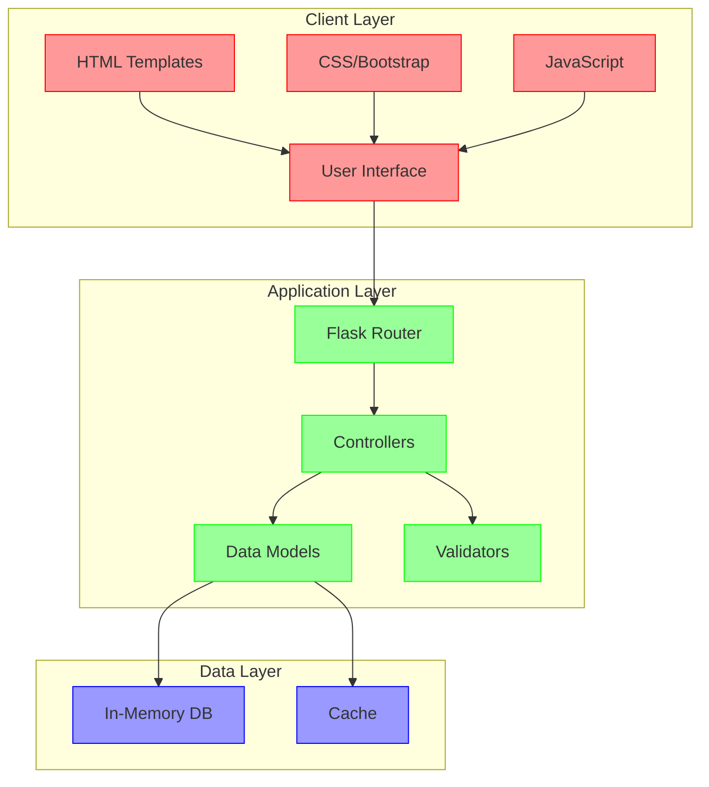
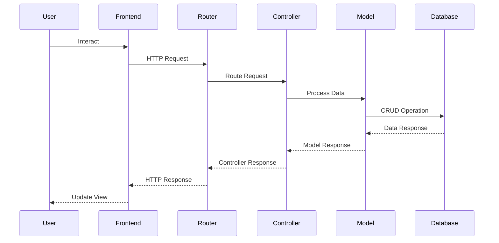
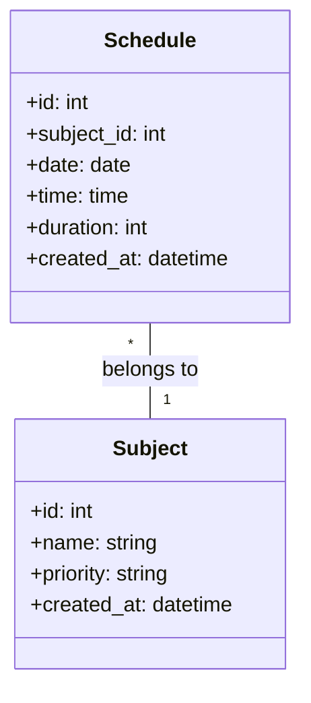
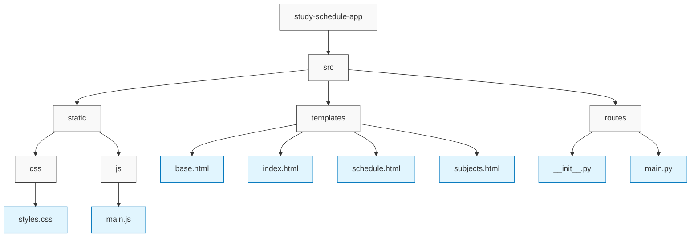

# Study Schedule Application Architecture 🎨

## System Overview 🏗️

```mermaid
graph TD
    subgraph "Client Layer"
        UI[User Interface]
        HTML[HTML Templates]
        CSS[CSS/Bootstrap]
        JS[JavaScript]
    end

    subgraph "Application Layer"
        Router[Flask Router]
        Controllers[Controllers]
        Models[Data Models]
        Validators[Validators]
    end

    subgraph "Data Layer"
        InMemDB[In-Memory DB]
        Cache[Cache]
    end

    UI --> Router
    HTML --> UI
    CSS --> UI
    JS --> UI
    Router --> Controllers
    Controllers --> Models
    Controllers --> Validators
    Models --> InMemDB
    Models --> Cache

    classDef clientLayer fill:#ff9999,stroke:#ff0000
    classDef appLayer fill:#99ff99,stroke:#00ff00
    classDef dataLayer fill:#9999ff,stroke:#0000ff

    class UI,HTML,CSS,JS clientLayer
    class Router,Controllers,Models,Validators appLayer
    class InMemDB,Cache dataLayer
```

## Component Flow

```mermaid
sequenceDiagram
    participant User as User
    participant UI as Frontend
    participant Router as Router
    participant Controller as Controller
    participant Model as Model
    participant DB as Database

    User->>UI: Interact
    UI->>Router: HTTP Request
    Router->>Controller: Route Request
    Controller->>Model: Process Data
    Model->>DB: CRUD Operation
    DB-->>Model: Data Response
    Model-->>Controller: Model Response
    Controller-->>Router: Controller Response
    Router-->>UI: HTTP Response
    UI-->>User: Update View
```

## Data Model

```mermaid
classDiagram
    class Subject {
        +id: int
        +name: string
        +priority: string
        +created_at: datetime
    }

    class Schedule {
        +id: int
        +subject_id: int
        +date: date
        +time: time
        +duration: int
        +created_at: datetime
    }

    Schedule "*" -- "1" Subject: belongs to
```

## Project Structure

```mermaid
graph TD
    Root[study-schedule-app] --> Src[src]
    Src --> Static[static]
    Src --> Templates[templates]
    Src --> Routes[routes]
    
    Static --> CSS[css]
    Static --> JS[js]
    CSS --> Styles[styles.css]
    JS --> Main[main.js]
    
    Templates --> Base[base.html]
    Templates --> Index[index.html]
    Templates --> Schedule[schedule.html]
    Templates --> Subjects[subjects.html]
    
    Routes --> Init[__init__.py]
    Routes --> MainRoutes[main.py]

    classDef default fill:#f9f9f9,stroke:#333
    classDef files fill:#e1f5fe,stroke:#0277bd
    
    class Styles,Main,Base,Index,Schedule,Subjects,Init,MainRoutes files
```